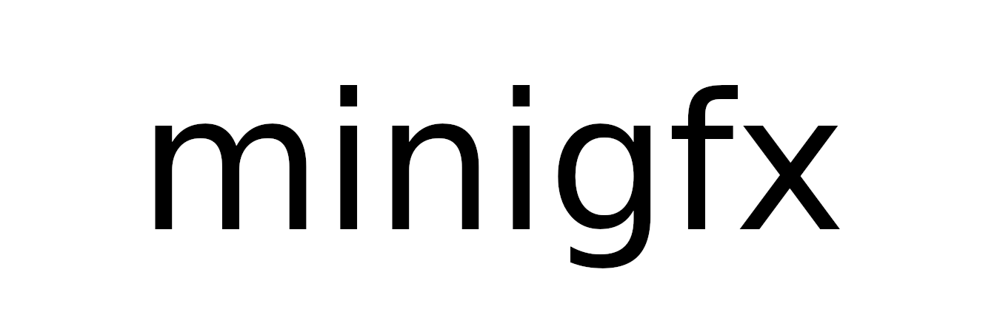

# minigfx
Small graphics library made in C

## Intended to be:
- Simple to understand
- Intuitive
- Fun to use

## Features
- Cross platform: Windows and Linux. To see how to work with Windows, check out the wiki
- Creating windows easily
- Keyboard and mouse input
- Draw and manage shapes (pixels, rectangles and circles)
- Draw and manage images
- Drawing text using the amazing [fontstash](https://github.com/memononen/fontstash)
- Usable for a variety of things; not just games! (check examples/graph as an example)

## Dependencies
OpenGL, GLFW

## Compiling a minigfx application
Unix systems
```
$ gcc main.c -lGL -lglfw -lm
```
Windows systems
```
$ gcc main.c -I include/ -L lib/ -lglfw3 -lopengl32 -lgdi32 -lwinmm -o main.exe
```

## minigfx example application
Please check the wiki to see how to work with minigfx properly.
```
#define MINIGFX_IMPLEMENTATION
#include "minigfx.h"

int main()
{
    mgfx_CreateWindow(1024, 600, "Basic Window in minigfx");
    int font = mgfx_LoadFont("font.ttf");

    while (!mgfx_WindowCloses()) {
        mgfx_StartDrawing();
        mgfx_ClearTo(WHITE);
        mgfx_DrawText(font, "Hey! Your first window!", 10.0, 10.0, 30.0, LIGHTGRAY);
        mgfx_StopDrawing();
    }

    mgfx_CloseWindow();
    return 0;
}
```

## License
minigfx is licensed under zlib. Check LICENSE for more information
