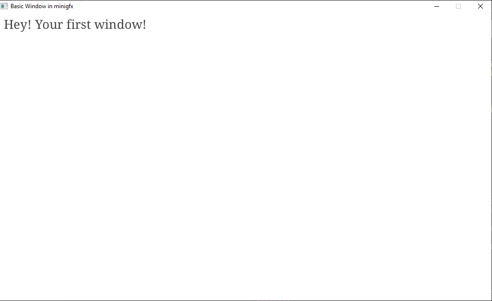

# minigfx: working on Windows

I'm not a big fan of Windows... But I found a way to compile minigfx applications in an easy way and without Visual Studio (for those that don't use it. For those who use it, I'm sorry.)

Before you start you'll need some glfw folders:
- include
- lib

These folders will allow for linking glfw3 and making minigfx work

**You will need three folders in your project: include, lib and external, as well as minigfx.h. All of these files should be put in one single place, not minigfx.h in a src folder, or the include folder somewhere else; they should all be in the same place**

Assuming you have MinGW installed [(or else check here...)](http://mingw-w64.org/doku.php/download/mingw-builds) and set up properly, the command is pretty simple. I recommend setting up a script to compile your applications.

```
$ gcc main.c -I include/ -L lib/ -lglfw3 -lopengl32 -lgdi32 -lwinmm -o main
```
And it will work just as if it was Linux.

